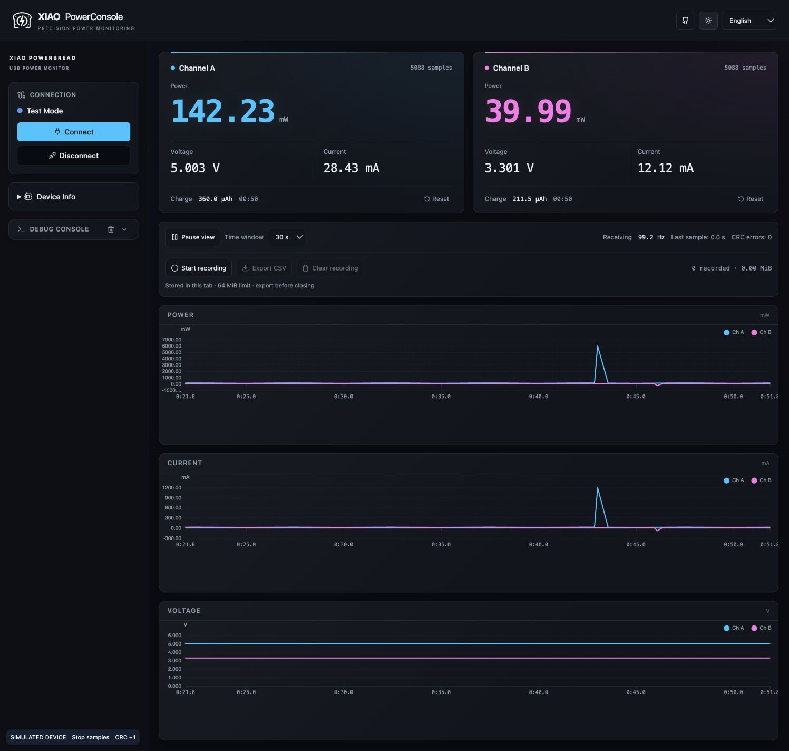

# XIAO PowerConsole Web

通过 Web Serial 连接 XIAO PowerBread 的双通道功率测量台。
React 19 + TypeScript + Vite + Tailwind CSS + Zustand + ECharts，纯前端，无后端服务。



## 状态与兼容性

当前作为公开预览版准备，尚未完成跨系统真机稳定性认证。

- 开发环境：Node.js 22 或 24、npm；可用 `nvm use` 选择项目版本。统一提交 `package-lock.json`。
- 浏览器：使用支持 Web Serial 的桌面 Chromium 浏览器；须通过 localhost 或 HTTPS 打开，并由用户选择串口。其他环境以 `navigator.serial` 是否可用为准，参考 [Web Serial 文档](https://developer.chrome.com/docs/capabilities/serial)。
- 硬件：[XIAO PowerBread](https://github.com/nicho810/XIAO-PowerBread)，固件须实现下述 XPB 二进制握手与帧格式；目前未声明经过验证的固件发布版本范围。
- 无硬件体验：启动开发服务器，打开 `/tests/preview.html`；页面数据为模拟数据，不代表真实测量结果。
- 正式部署仅上传 `dist/`，不公开开发服务器。

## 开发与验证

```sh
npm ci
npm run dev
npm test
npm run build
npm run preview
```

构建输出为 `dist/`。请通过 localhost 或 HTTPS 使用串口功能；应用会在不支持 Web Serial 的环境中给出错误提示。

`npm test` 使用模拟串口验证生命周期、协议、测量精度、积分与峰值抽样，不需要硬件。
开发服务器下的 `/tests/preview.html` 提供确定性测试数据，包括正负单点峰值和断流；该夹具不进入生产构建。

## 使用

1. 连接设备并点击 Connect，在浏览器中选择串口。
2. 应用以 115200 波特率执行 START → CONFIG → CONFIG_ACK，然后接收采样。
3. 主工作区优先显示双通道功率，电压、电流、电荷作为次级读数；下方依次排列功率、电流、电压趋势。
4. 设备校准参数和日志默认折叠；侧栏支持桌面拖拽与键盘左右键调整，窄屏采用单栏滚动布局。
5. Disconnect 可取消连接或关闭采集；关闭完成后才能再次连接。浏览器端口选择器若仍打开，需要先完成选择或取消。

## 测量语义

- 协议为 XPB 二进制帧：`AA 55 TYPE LEN PAYLOAD CRC8`；CRC-8/MAXIM 覆盖 TYPE、LEN 和 PAYLOAD。
- CONFIG 为 9 字节：两路 little-endian float32 分流电阻与一个版本字节。
- DATA 为 20 字节：两路总线/分流电压 float32 与 uint32 毫秒时间戳。
- 计算使用完整 float32 解码精度；格式化仅发生在显示层。无效载荷、非有限数值和非正分流电阻会终止会话并显示错误。
- 电荷通过原始采样电流的梯形积分得到，单位 µAh/mAh；它不是能量 mWh。
- 只对 `0 < dt ≤ 500ms` 的有效间隔积分和计时；等待连接、断流和时钟复位不计入时长。
- 断开连接清空实时图表与读数；累计电荷和有效时长跨连接保留，由各通道 Reset 独立清除。
- 图表保留每桶首尾和极值，默认直线连接；超过 500ms 的缺口显示断线。抽样仅用于显示，不参与计算。
- 环形缓冲区保存最近 3000 个样本（100Hz 时约 30 秒）。设备时钟倒退时清空图表，开始新时间段。

## 架构

```text
设备 → SerialConnection（单 reader）→ SerialSession（握手/重握手/采样）
    → FrameParser → codec → measurement-store → 原始电荷积分
                                             → 图表极值抽样，15fps
                                             → 双通道读数，10Hz
```

详细模块地图与维护规范见 [AGENTS.md](AGENTS.md)。
真实硬件的长时间采集、拔插与操作系统驱动差异仍需设备联调验证。


## 暂停与联动查看

- 工具栏的“暂停显示”同步冻结三图、读数与电荷快照；采集、录制和健康状态继续更新。
- “恢复即时”跳到当前数据；暂停快照即使在断开或环形缓冲区覆盖后也保留，直到恢复显示。
- 可选择 5/10/30 秒时间窗，暂停时也能调整；可查看范围仍受当前 3000 样本缓冲区限制。
- 三图共享抽样时间点和游标，显示同一采样的双通道电压、电流、功率，游标时间精确到毫秒。

## CSV 录制

- 连接后点击“开始录制”，从该时刻追加原始采样；不补录此前图表缓冲区数据。
- 停止后可继续追加；每次继续或设备时间倒退都会递增 segment，便于区分采集片段。
- 导出的是点击时的完整行快照，不中断正在进行的录制；断开会自动停止录制但保留已录数据。
- CSV 包含样本序号、segment、接收 UTC、设备毫秒、双通道总线电压/分流电压/电流/功率以及校准电阻和协议版本；列名注明 SI 单位。
- 录制独立于图表缓冲区，以分块文本保存在当前分页面内存；CSV 达 64 MiB 时自动停止，保留完整行并提示导出。刷新/关闭前应导出。
- “清除录制”只在停止状态可用，不会重置实时测量或累计电荷。

## 采集健康状态

显示最近约 2 秒的有效样本接收速率、最后有效采样的年龄与 CRC 错误数。连接开始时重置统计；超过 2 秒没有有效样本时显示断流，数据恢复后自动恢复正常。主机单调时钟用于健康检测，设备时钟复位不影响它。CRC 错误计数仅代表校验失败帧，不是精确丢包数。

## 参与贡献

问题反馈与提交前检查见 [CONTRIBUTING.md](CONTRIBUTING.md)。GitHub Actions 在 push 和 PR 时运行 Node 22/24 的安装、测试、构建与依赖审计。

发布前真机检查：连续采集至少一小时、反复拔插与重连、握手取消、暂停期间录制、CSV 与设备数据核对；记录操作系统、浏览器版本、固件版本及结果。模拟测试不能替代这些检查。

## 许可证

Copyright (C) 2026 Nicho Deng.

本项目采用 **GNU GPL v3.0 only**（SPDX: `GPL-3.0-only`），完整条款见 [LICENSE](LICENSE)。允许商业使用、修改和分发；分发本项目或受 GPL 覆盖的修改版时，须遵守 GPLv3，保留版权及许可声明、注明修改，并按许可要求向接收者提供对应源码。内部使用且不分发的修改无需公开；也不要求把源码发布给全世界。

本软件不提供任何担保，具体免责条款见 LICENSE。第三方依赖保留各自许可证；关联硬件和固件项目的授权以各自仓库为准。

部署到 Cloudflare Workers 的前端 JavaScript 会被发送到用户浏览器。发布构建产物时，应同时提供对应版本的完整源码及必要构建文件，并在下载或应用入口显著提供源码和许可证链接；建议使用固定 release/tag 对应部署版本，不能只链接可能继续变化的默认分支。
